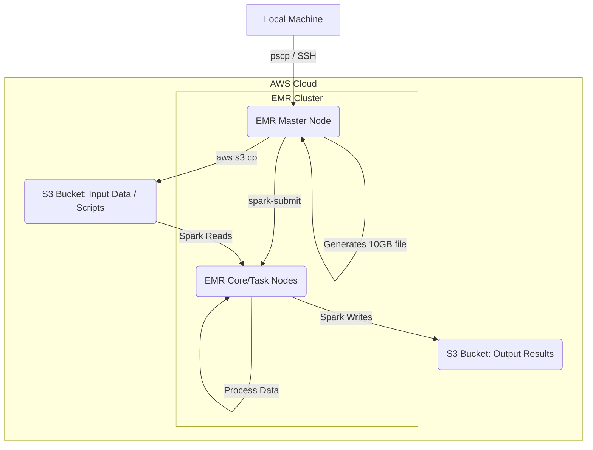

# 🚀 AWS EMR PySpark Word Count: Scaling from 124MB to 10GB ☁️


This project demonstrates a classic Word Count application implemented using PySpark on Amazon Web Services (AWS) Elastic MapReduce (EMR). It showcases the process of setting up the AWS infrastructure, preparing data (scaling from an initial 124MB text file to a 10GB file), and executing a distributed data processing job.

**Aydın Adnan Menderes University**
**Engineering Faculty**
**Computer Science Engineering Department**
**CSE423 Cloud Computing, Spring 2024/2025**

---

## 📝 Table of Contents

1.  [Project Overview](#project-overview)
2.  [Project Goals](#project-goals)
3.  [Technologies Used](#technologies-used)
4.  [System Architecture](#system-architecture)
5.  [Prerequisites](#prerequisites)
6.  [Setup and Execution Steps](#setup-and-execution-steps)
    *   [Step 1: Create S3 Bucket](#step-1-create-s3-bucket)
    *   [Step 2: Create EMR Cluster](#step-2-create-emr-cluster)
    *   [Step 3: Configure SSH and Security Groups](#step-3-configure-ssh-and-security-groups)
    *   [Step 4: Connect to EMR Master Node](#step-4-connect-to-emr-master-node)
    *   [Step 5: Data Preparation on EMR](#step-5-data-preparation-on-emr)
    *   [Step 6: Code Preparation](#step-6-code-preparation)
    *   [Step 7: Execute the PySpark Job](#step-7-execute-the-pyspark-job)
7.  [The PySpark Script (`word_count.py`)](#the-pyspark-script-word_countpy)
8.  [Expected Output & Results](#expected-output--results)
9.  [Challenges Encountered](#challenges-encountered)
10. [Team Contributions](#team-contributions)
11. [Acknowledgements](#acknowledgements)
12. [References](#references)

---

## 🌟 Project Overview

The primary objective of this project is to perform a word count on a large text dataset using the distributed computing capabilities of Apache Spark, orchestrated by AWS EMR. The process involves:
1.  Setting up an S3 bucket for storing input data, scripts, and output results.
2.  Configuring and launching an AWS EMR cluster with Spark and Hadoop.
3.  Transferring an initial 124MB text file (`leipzig124MB.txt`) to the EMR cluster.
4.  Scaling this file up to approximately 10GB (`large_10gb_file.txt`) directly on the EMR master node.
5.  Uploading the 10GB file to S3.
6.  Executing a PySpark script (`word_count.py`) via `spark-submit` to process the 10GB file from S3 and write the word counts back to S3.

---

## 🎯 Project Goals

*   Demonstrate understanding of AWS S3 for data storage.
*   Illustrate the setup and configuration of an AWS EMR cluster.
*   Showcase distributed data processing using PySpark.
*   Handle large datasets (scaling up to 10GB).
*   Understand the workflow of submitting and monitoring Spark jobs on EMR.
*   Practice connecting to and interacting with EMR nodes via SSH.

---

## 🛠️ Technologies Used

*   **Cloud Platform:** Amazon Web Services (AWS)
    *   **AWS S3 (Simple Storage Service):** For storing input text files, PySpark scripts, and output word counts.
    *   **AWS EMR (Elastic MapReduce):** Managed cluster platform for running big data frameworks like Apache Spark and Hadoop.
    *   **AWS EC2 (Elastic Compute Cloud):** Underlying compute instances for EMR nodes.
*   **Big Data Framework:**
    *   **Apache Spark (PySpark):** Fast and general-purpose cluster computing system, used for the word count logic.
    *   **Apache Hadoop (HDFS & YARN):** Used by EMR for distributed storage (though S3 is primary here) and cluster resource management.
*   **Programming Language:** Python 3.x
*   **Tools:**
    *   **PuTTY:** SSH client for connecting to the EMR master node.
    *   **pscp (PuTTY Secure Copy client):** For transferring files to the EMR master node.
    *   **AWS CLI:** For interacting with AWS services (e.g., copying files to/from S3 from EMR).

---

A simplified view of the architecture:



---

## 📋 Prerequisites

*   An AWS Account (preferably with Learner Lab access if applicable, or sufficient permissions).
*   AWS CLI configured locally (optional, but useful for S3 interactions).
*   PuTTY and `pscp` installed (or equivalent SSH and SCP clients for other OS).
*   The `leipzig124MB.txt` file (or any text file to be used as the base).
*   The `word_count.py` script.

---

## 🚀 Setup and Execution Steps

### Step 1: Create S3 Bucket

1.  Navigate to the AWS S3 console.
2.  Click "Create bucket".
3.  **Bucket name:** Choose a globally unique name (e.g., `your-unique-name-cse423-wordcount`).
4.  **AWS Region:** Select `US East (N. Virginia) us-east-1`.
5.  **Bucket type:** General purpose.
6.  **Block Public Access settings:** Check "Block all public access" (Recommended for security).
7.  Keep other settings as default (e.g., Bucket Versioning: Disable, Default encryption: SSE-S3).
8.  Click "Create bucket".

    *Within your bucket, you might want to create folders like `input/`, `scripts/`, and `output/` for better organization.*

    *(Refer to `assets/s3_bucket_config.png` for an example screenshot)*

### Step 2: Create EMR Cluster

1.  Navigate to the AWS EMR console.
2.  Click "Create cluster".
3.  **Name and applications:**
    *   **Name:** `My-WordCount-Cluster` (or similar).
    *   **Amazon EMR release:** Select a recent release (e.g., `emr-7.0.0` or as used in project `emr-7.8.0`).
    *   **Applications:** Select `Spark` and `Hadoop` (or a bundle like "Core Hadoop" or "Spark Interactive" which includes necessary components).
        *   Ensure **Spark 3.5.x** (or compatible) and **Hadoop 3.4.x** are selected.
4.  **Cluster configuration:**
    *   Choose **Uniform instance groups**.
    *   **Primary Node (Master):** `m5.xlarge` (4 vCore, 16 GiB memory).
    *   **Core Nodes:** `m5.xlarge` (1 instance, 4 vCore, 16 GiB memory).
    *   **Task Nodes (Optional but recommended for scaling):** `m5.xlarge` (1 instance, 4 vCore, 16 GiB memory).
    *   **EBS root volume:** Set to **40 GiB** (General Purpose SSD gp3).
5.  **Cluster scaling and provisioning:**
    *   Select **Set cluster size manually**.
    *   Confirm instance counts for Core (1) and Task (1).
6.  **Networking:**
    *   Select your **VPC** and a **subnet**. Usually, the default VPC and a public subnet in `us-east-1` will work.
7.  **Cluster logs:**
    *   Enable automatic archiving to an S3 location (e.g., `s3://your-emr-logs-bucket/wordcount-cluster-logs/`).
8.  **Security and access:**
    *   **EC2 key pair:** Select an existing EC2 key pair or create a new one. **Download the `.pem` file and convert it to `.ppk` using PuTTYgen for use with PuTTY.**
    *   **IAM roles:**
        *   **Amazon EMR service role:** `EMR_DefaultRole` (or let EMR create one).
        *   **EC2 instance profile for Amazon EMR:** `EMR_EC2_DefaultRole` (or let EMR create one).
9.  Click "Create cluster". Wait for the cluster to be in the "Waiting" state.

    *(Refer to `assets/emr_cluster_config_1.png` and `assets/emr_cluster_config_2.png` for example screenshots)*

### Step 3: Configure SSH and Security Groups

1.  Once the EMR cluster is running, find its Master public DNS.
2.  Go to the EC2 console -> Security Groups.
3.  Find the security group associated with your EMR Master node (e.g., `ElasticMapReduce-master`).
4.  Edit its **Inbound rules**.
5.  Add a new rule:
    *   **Type:** `SSH`
    *   **Protocol:** `TCP`
    *   **Port range:** `22`
    *   **Source:** `My IP` (This will automatically fill in your current public IP address. For a more permanent solution if your IP changes, consider a specific IP range or VPN).
    *   **Description:** `SSH access for EMR Master`
6.  Save the rules.

    *(Refer to `assets/emr_security_group.png` for an example screenshot)*

### Step 4: Connect to EMR Master Node

1.  Open PuTTY.
2.  **Host Name (or IP address):** `hadoop@<MASTER_PUBLIC_DNS>` (e.g., `hadoop@ec2-xx-xx-xx-xx.compute-1.amazonaws.com`).
3.  **Port:** `22`.
4.  In the left pane, navigate to **Connection > SSH > Auth > Credentials**.
5.  **Private key file for authentication:** Browse and select your `.ppk` file.
6.  (Optional) Go back to **Session**, give your session a name under "Saved Sessions" and click "Save".
7.  Click "Open". Accept the server's host key if prompted.

    *(Refer to `assets/putty_connection.png` for an example screenshot)*

### Step 5: Data Preparation on EMR

1.  **Transfer initial 124MB file and script to EMR Master:**
    Open a local command prompt or terminal.
    ```bash
    # Replace paths and DNS with your actual values
    pscp -i "C:\path\to\your\keyfile.ppk" "C:\path\to\leipzig124MB.txt" hadoop@<MASTER_PUBLIC_DNS>:/home/hadoop/
    pscp -i "C:\path\to\your\keyfile.ppk" "C:\path\to\src\word_count.py" hadoop@<MASTER_PUBLIC_DNS>:/home/hadoop/
    ```

2.  **Generate 10GB file on EMR Master Node (in PuTTY session):**
    ```bash
    cd /home/hadoop/
    echo "Starting file generation..."
    # This loop will concatenate the 124MB file 83 times (83 * 124MB approx 10.0GB)
    # Adjust the number of iterations if your base file size is different or target is slightly different.
    for i in {1..83}; do
        cat leipzig124MB.txt >> large_10gb_file.txt
        if (($i % 10 == 0)); then
            echo "Completed iteration $i of 83"
        fi
    done
    echo "File generation complete!"
    ls -lh large_10gb_file.txt # Check file size
    ```
    *(Refer to `assets/data_generation_emr.png` for an example screenshot)*

3.  **Upload 10GB file and script to S3 from EMR Master Node:**
    ```bash
    # Replace your-unique-name-cse423-wordcount with your bucket name
    aws s3 cp large_10gb_file.txt s3://your-unique-name-cse423-wordcount/input/large_10gb_file.txt
    aws s3 cp word_count.py s3://your-unique-name-cse423-wordcount/scripts/word_count.py
    ```
    *(Refer to `assets/s3_input_10gb.png` for seeing the file in S3)*

### Step 6: Code Preparation
The `word_count.py` script should already be on the EMR master node from Step 5.1 and also uploaded to S3 from Step 5.3. We will run it from S3.

### Step 7: Execute the PySpark Job

In your PuTTY session connected to the EMR Master Node:

```bash
spark-submit \
s3://your-unique-name-cse423-wordcount/scripts/word_count.py \
s3://your-unique-name-cse423-wordcount/input/large_10gb_file.txt \
s3://your-unique-name-cse423-wordcount/output/wordcount_results_10gb/

  * The first argument to spark-submit is the S3 path to your PySpark script.
  * The second argument is the S3 path to your 10GB input file (passed as sys.argv[1] to your script).
  * The third argument is the S3 path where the output results will be stored (passed as sys.argv[2] to your script). This S3 path must not already exist, as Spark will create it.

Monitor the job progress in the YARN ResourceManager UI (link available in EMR console) or through the command line output.
The logs will also be available in the S3 log bucket you configured.

🐍 The PySpark Script (word_count.py)

```bash
import sys
from pyspark.sql import SparkSession # SparkSession, modern PySpark uygulamalarının giriş noktasıdır. DataFrame API'si ve SparkContext'i yönetir.
import re   # re modülü, düzenli ifadeler (regular expressions) kullanarak metin içinde desen eşleştirme yapmak için kullanılır.
import time # time modülü, kodun belirli bölümlerinin ne kadar sürede çalıştığını ölçmek gibi zamanla ilgili işlemler için kullanılır.
import socket # socket modülü, ağ ile ilgili işlemler yapmak için kullanılır. Burada driver programının çalıştığı makinenin hostname ve IP adresini almak için kullanılıyor.

# Bu blok, betik doğrudan çalıştırıldığında yürütülür (başka bir modül tarafından import edildiğinde değil).
# PySpark uygulamalarının ana mantığı genellikle bu blok içinde yer alır.
if __name__ == "__main__":
    # Komut satırından verilen argümanların sayısını kontrol et.
    # Betik adı dahil olmak üzere toplam 3 argüman bekleniyor:
    # sys.argv[0]: betik_adı.py
    # sys.argv[1]: giriş_dosyası_yolu
    # sys.argv[2]: çıkış_dizini_yolu
    if len(sys.argv) != 3:
        # Corrected usage message for clarity if run with wrong args
        print("Usage: spark-submit wordcount.py <s3_input_path> <s3_output_path>", file=sys.stderr)
        sys.exit(-1)

    # Komut satırından gelen birinci argümanı (indeks 1) giriş dosyasının S3 yolu olarak al.
    input_path = sys.argv[1]
    # Komut satırından gelen ikinci argümanı (indeks 2) çıktı sonuçlarının kaydedileceği S3 yolu olarak al.
    output_path = sys.argv[2]

    # İşlemin başlangıç zamanını kaydet. Bu, toplam çalışma süresini hesaplamak için kullanılacak.
    start_time = time.time()

    # SparkSession nesnesi oluştur. 
    spark = SparkSession.builder.appName("CloudProjectWordCount").getOrCreate()

    # SparkContext'i SparkSession üzerinden al.
    sc = spark.sparkContext

    # Driver programının (bu betiğin) çalıştığı makinenin hostname'ini (makine adı) al.
    hostname = socket.gethostname()
    # Alınan hostname'e karşılık gelen IP adresini çöz (bul).
    ip_address = socket.gethostbyname(hostname)
    # Driver'ın hostname ve IP adresini konsola yazdır.
    print(f"Driver Hostname: {hostname}, IP Address: {ip_address}")
    # Kullanılan giriş ve çıkış yollarını konsola yazdır.
    print(f"Input Path: {input_path}")
    print(f"Output Path: {output_path}")

    # Belirtilen S3 yolundan (input_path) metin dosyasını oku ve bir RDD (Resilient Distributed Dataset) olarak yükle.
    text_rdd = sc.textFile(input_path)

    # Kelimelere ayırma, küçük harfe çevirme ve sayma işlemlerini içeren dönüşüm (transformation) zinciri:
    word_counts = text_rdd.flatMap(lambda line: re.findall(r'\b[a-zA-Z]+\b', line.lower())) \
                          .map(lambda word: (word, 1)) \
                          .reduceByKey(lambda a, b: a + b)
    
    # Top 10 kelimeyi sadece bilgi amaçlı göstermek için.
    try:
        top_10_words = word_counts.takeOrdered(10, key=lambda x: -x[1])
        print("-" * 30) 
        print("Top 10 words (for informational purposes):") 
        for word, count in top_10_words:
            print(f"{word}: {count}")
        print("-" * 30) 
    except Exception as e:
        print(f"Could not get top 10 words: {e}")

    # Tüm kelime sayılarını S3'e kaydet.
    print(f"Saving all word counts to: {output_path}") 
    try:
        word_counts.saveAsTextFile(output_path)
        print("Successfully saved word counts.")
    except Exception as e:
        print(f"Error saving word counts: {e}")
        spark.stop()
        sys.exit(-1)

    # İşlemin bitiş zamanını kaydet.
    end_time = time.time()
    # Toplam çalışma süresini hesapla.
    total_time = end_time - start_time
    # Toplam çalışma süresini saniye cinsinden yazdır.
    print(f"Execution Time: {total_time:.2f} seconds")

    # SparkSession'ı durdur.
    spark.stop()
```

✅ Expected Output & Results

Upon successful execution, the PySpark job will create a directory in your S3 output path (e.g., s3://your-unique-name-cse423-wordcount/output/wordcount_results_10gb/). This directory will contain:

  * A _SUCCESS file (empty marker file indicating successful completion).
  * Multiple part-xxxxx files, each containing a portion of the word counts. The number of part files depends on the number of reducers/partitions Spark used.

Example content of a part-xxxxx file:

```bash
('the', 113891604)
('of', 49558138)
('to', 47168485)
...
('example', 303033)
('cloud', 15023)
...
```

The console output from spark-submit will show the "Top 10 words" and the "Execution Time".
For instance (from project logs):

```bash
------------------------------
Top 10 words (for informational purposes):
the: 113891604
of: 49558138
to: 47168485
a: 42553270
in: 39452224
and: 37340123
s: 21201437
said: 17921609
for: 17864007
that: 17118750
------------------------------
Saving all word counts to: s3://cloudodevi/cikti/proje_sonuclari/
Successfully saved word counts.
Execution Time: 604.67 seconds
```

(Refer to assets/s3_output_folders.png and assets/s3_output_example.png for example screenshots of the S3 output)
(Refer to logs/spark_job_log_example.txt for a sample log output)

🚧 Challenges Encountered

  * AWS Learner Lab Limitations: Working within the AWS Learner Lab environment sometimes presents restrictions on available instance types, service quotas, or specific configurations. This required careful selection of EMR configurations and resource management.
  * Data Transfer Times: Uploading the 10GB file to S3 from the EMR master node can be time-consuming depending on the network bandwidth of the EMR instance.
  * Debugging on EMR: Identifying issues in Spark jobs running on EMR often requires inspecting YARN logs, Spark UI (if history server is configured), and S3 logs, which can be a learning curve.

🧑‍🤝‍🧑 Team

Yusuf TURAN
Mustafa Cihan AYİNDİ
Köksal Kerem TANIL
Rıza KARAKAYA

🙏 Acknowledgements

 * Aydın Adnan Menderes University for providing the platform for this project.
 * Asst. Prof. Dr. Hüseyin ABACI for guidance and support throughout the CSE423 Cloud Computing course.

📚 References

  * Amazon S3 Nedir ve Bucket Nasıl Oluşturulur?
  * Getting Started with AWS EMR - Part I
  * AWS Documentation
  * Apache Hadoop Documentation
  * Apache Spark Documentation (PySpark)
